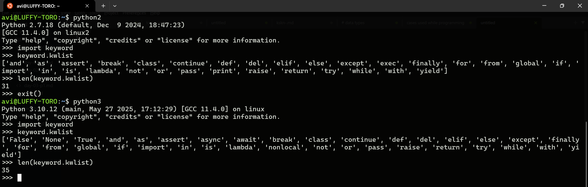

# python introduction

## python 2.x vs 3.x

### python 2.x

- python 2.x has `31` keywords.
- python 2.x `9/3` give `3`
- here `print` is a keyword

### python 3.x

- python 3.x has `32` keywords.
- python 3.x `9/3` gives `3.0`
- here `print` is a in build function.



---

## Other important points

1. **python** is high level language ( English like programming language ).
1. It is named after the British comedy television series "Monty **Python**'s Flying Circus."
   When van Rossum began implementing **Python**, he was reading the published scripts from the show and thought he needed a name that was short, unique, and slightly mysterious. He decided to call the language Python, inspired by his enjoyment of the comedy series.
1. Guido van Rossum is the one developed **python**
1. Python is interpreter language.
1. Interpreter language is one which executes line by line.
1. Application of python are scientific calculation, game dev, web dev, AI, ML, Data analytics, IOT.
1. python is popular for its easier syntax. Hence its learning curve is low. It is easy to learn. 
1. Has huge community support and libraries support.
1. [python.org](https://www.python.org/) is the official website.

---

## python 2 vs python 3

python 2.x has keywords where `print` is a keyword.

- Hence as `print` is a keyword in python, we are able to use without any `()`.
- In python 3, print has been changed to build in function. Hence we must have to use `()` in `print`.

```python
# python 2
# in python 2, by default it will return int
>>> 22/7
3
# python 3
# here it will be in float
>>> 22/7
3.142857142857143
```

floor division `//`

- python floor division will be rounded towards -ve side.

```python
>>> 5//2
2
>>> 5.0//2
2.0
>>> 5//2.0
2.0
>>> 5//-2.0
-3.0
```